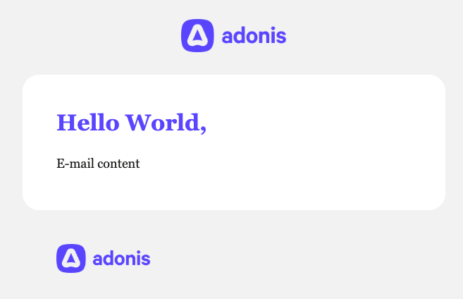

# docker-adonis-mailer

> Dockerized Adonis application to send e-mails with MJML

## Usage

### Build your docker-compose.yml

`docker-compose.yml`

```yml
version: '3.8'

services:
  mailer:
    restart: always
    image: louismazel/mailer:v1.0.0
    ports:
      - 3333:3333 # or PORT choosen
    env_file:
      - .env
    # optional
    volumes:
      - ./src/emails:/app/resources/views/emails
```

### Environment variables file

`.env`

```dosini
PORT=<port> # required
HOST=<host> # default 0.0.0.0

CORS_ORIGIN="*" # optional - string only - if not provided, only the current origin where the image is running is allowed

MAIL_DRIVER=<mail_driver> # required - mailgun or smtp

# if you choose  MAIL_DRIVER=smtp
SMTP_HOST=<smtp_host>
SMTP_PORT=<smtp_port>
SMTP_SECURE=<smtp_port> # boolean
SMTP_USERNAME=<smtp_username>
SMTP_PASSWORD=<smtp_password>

# if you choose  MAIL_DRIVER=mailgun
MAILGUN_API_KEY=<mailgun_api_key> # optional
MAILGUN_DOMAIN=<mailgun_domain> # optional
MAILGUN_BASE_URL=<mailgun_base_url> # optional

# default value for e-mails - can be set or override in request body
SENDER_MAIL=<sender_mail> # optional
SENDER_NAME=<sender_name> # optional
REPLY_TO_MAIL=<reply_to_mail> # optional
REPLY_TO_NAME=<reply_to_name> # optional
```

#### CORS Origin configuration

You can control the origins to allow for the CORS request using the CORS_ORIGIN environment variables.
This property controls [the Access-Control-Allow-Origin](https://developer.mozilla.org/en-US/docs/Web/HTTP/Headers/Access-Control-Allow-Origin) header.

Should be a string, examples:

- `"*"` - _Allow all origin_
- `"*.example.com"` - _Allow all subdomain of example.com_
- `"example.com"` - _Allow only requests from exemple.com_
- `"example-1.com,example-2.com"` - _Allow requests from example-1.com and example-2.com_
- etc...

**Documentation**
[Adonis documentation - Allowed origin](https://docs.adonisjs.com/guides/security/cors#allowed-origin)

### Sending e-mail

You should send a `POST` request to `/emails/send`

In development mode: `http://localhost:3333/emails/send`

Request body:

```js
const body = {
  // required if SENDER_MAIL environment variable is not set
  fromEmail: 'me@example.com',
  // optional or equal to SENDER_NAME
  fromName: 'Team Example',
  // required
  toEmail: 'user@example.com',
  // optional
  toName: 'User Name',
  // optional or equal to REPLY_TO_MAIL
  replyToEmail: 'reply@example.com',
  // optional or equal to REPLY_TO_NAME
  replyToName: 'Team Example',
  // required
  subject: 'Subject of the e-mail',
  // default true - if false you should provide a template written in HTML in edge file
  mjml: true,
  // file name of your e-mail template - required if you use custom template
  template: 'example',
}
```

### Use the default template

To use it, you must not have volume in `docker-compose.yml` and not provide `template` in request body

The default template:

```html
<mjml>
  <mj-head>
    <mj-attributes>
      <mj-all font-family="'IBM Plex Sans', 'Georgia', 'Times New Roman', serif" />
      <mj-text font-size="18px" color="{{ textColor }}" line-height="2" padding="0" />
    </mj-attributes>
    <mj-font
      href="https://fonts.googleapis.com/css?family=DM+Serif+Display:normal,italic,bold&display=swap"
      name="DM Serif Display"
    />
    <mj-font
      href="https://fonts.googleapis.com/css?family=IBM+Plex+Sans:normal,italic,bold&display=swap"
      name="IBM Plex Sans"
    />
  </mj-head>
  <mj-body background-color="#F2F2F2">
    <mj-section padding="32px">
      <mj-column>
        <mj-image
          padding="0px"
          href="{{ logoLink }}"
          src="{{ logoSrc }}"
          alt="logo"
          width="150px"
        />
      </mj-column>
    </mj-section>

    <mj-section background-color="#FFFFFF" border-radius="24px" padding="48px">
      <mj-column>
        @if(title)
        <mj-text
          color="{{ titleColor }}"
          font-size="32px"
          line-height="1.25"
          padding-bottom="20px"
          font-family="'DM Serif Display', 'Georgia', 'Times New Roman', serif"
        >
          <strong> {{ title }}, </strong>
        </mj-text>
        @endif @if(content)
        <mj-text> {{{ content }}} </mj-text>
        @endif
      </mj-column>
    </mj-section>

    <mj-section padding="48px">
      <mj-column>
        <mj-image
          align="left"
          padding="0px"
          href="{{ logoLink }}"
          src="{{ logoSrc }}"
          width="134px"
        ></mj-image>
      </mj-column>
    </mj-section>
  </mj-body>
</mjml>
```

1. Send request with a body like this

```js
const body = {
  // Title in the e-mail
  title: 'Hello World,',
  // link open on logo click
  logoLink: 'https://adonisjs.com/',
  // URL of the logo
  logoSrc:
    'https://camo.githubusercontent.com/076aacc894daf3d9065f7d5bd1d7e8a3d0511668576cd66afddd0ce4af524eaa/68747470733a2f2f692e696d6775722e636f6d2f32774764454a4e2e706e67',
  // text color of e-mail
  textColor: '#1a1a19',
  // title text color
  titleColor: '#5a45ff',
  // content of e-mail, can be written in HTML
  content: '<p style="margin: 0">E-mail content</p>',
}
```

2. Result



### Custom templates

Templates should be edge files and use the templating syntax of Adonis ([see default template example](./resources/views/emails/transactional.edge))

[Adonis templating syntax documentation](https://docs.adonisjs.com/guides/views/templating-syntax)

2. Provide your templates

Provide your templates in `docker-compose.yml` volume configuration

```yml
version: '3.8'

services:
  mailer:
    ...
    volumes:
      - ./path/to/local/emails/directory:/app/resources/views/emails
```

3. Provide the template to use in body request

```js
const body = {
  ...
  "template": "example"
  ...
}
```

---

## Contributing

### Run server in development mode

```bash
make dev
```

### Build application for production

```bash
make build
```

### Lint and format application

#### Lint with Eslint

```bash
make lint
```

#### Format files with Prettier

```bash
make format
```

### Check dependencies updates

```bash
make check-update
```

### Adonis commands

#### To see all adonis commands, run

```bash
node ace -h
```

#### Create a new controller

```bash
node ace make:controller <% ControllerName %>
```

### Docker

#### Build and start dev server

You should use this command when the container isn't already initialized

```bash
make docker-up-build
```

#### Start dev server in container

```bash
make docker-up
```

#### Show server logs

```bash
make docker-logs
```

#### Stop server

```bash
make docker-stop
```

#### Stops containers and removes containers, networks, volumes, and images created by up

```bash
make docker-down
```

#### Build docker image

```bash
make docker-build
```
